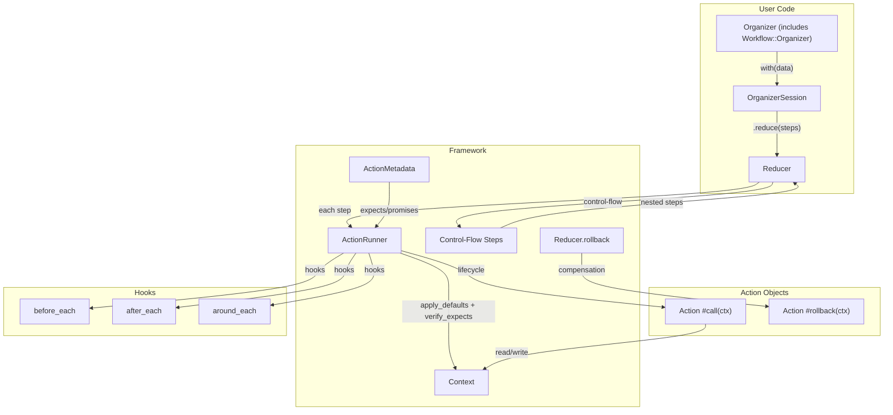
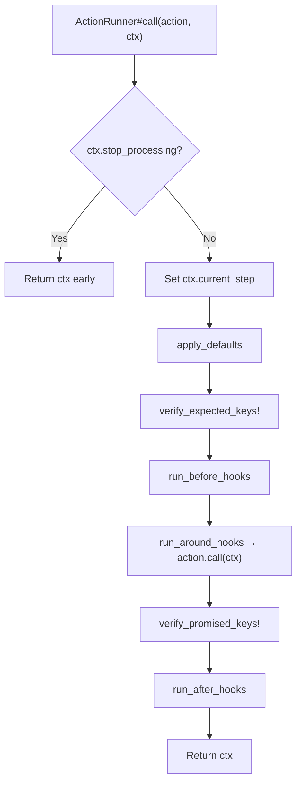

# Architecture

> Living document. Update in the same commit as any code change that affects
> the structure described here. See `AGENTS.md` §10.6 for the rules.

Actionflow is a Ruby workflow orchestration gem that combines
LightService-style context pipelines with explicit object composition and
constructor dependency injection. It provides small composable actions, a
shared workflow context, explicit input/output contracts, organizers, branching
and iteration, rollback, hooks, logging, localization, and testing helpers —
all built on ordinary Ruby objects.

---

## 1. Design Principles

### 1.1 Actions are ordinary objects

Actions include `Workflow::Action` and implement `#call(ctx)`. They are
instantiated with their dependencies via constructors. The framework provides
`#execute(ctx)` for full lifecycle execution (contract verification, hooks,
logging).

### 1.2 Context is for business data, not infrastructure

Workflow context carries order IDs, computed totals, flags, and messages. It
never carries payment gateways, mailers, loggers, or API clients. Those are
constructor-injected.

### 1.3 Organizers compose objects, not classes

Organizers receive action instances through constructors and compose them via
`reduce`. Steps are callable objects, not class constants.

### 1.4 The framework owns execution lifecycle

`ActionRunner` handles defaults, contract verification, hooks, and error
tracking. Actions own business logic only.

### 1.5 Controlled failure vs exceptional failure

- `ctx.fail!` stops the pipeline with a business-level failure message.
- `ctx.fail_with_rollback!` triggers reverse-order compensation.
- Exceptions bubble up by default — the framework does not swallow them.

---

## 2. Tech Stack

| Layer          | Technology      | Version   |
| -------------- | --------------- | --------- |
| Language       | Ruby            | ≥ 3.2     |
| Linting        | Standard Ruby   | latest    |
| Type signatures| RBS             | latest    |
| Tests          | RSpec           | latest    |
| Coverage       | SimpleCov       | latest    |
| Build          | Bundler + Rake  | latest    |

Zero runtime dependencies. The gem ships with no gems it depends on at
runtime.

---

## 3. System Overview



---

## 4. Context

The context carries workflow data and status.

Key design decisions:
- **Composition over inheritance.** Context wraps a `Hash` internally; it does
  not inherit from `Hash`.
- **Symbolized keys.** All keys are stored as symbols.
- **Alias support.** Keys can be aliased for renaming across steps.

### 4.1 State fields

| Field               | Type      | Purpose                                     |
| -------------------- | --------- | ------------------------------------------- |
| `@data`              | Hash      | Business data (symbol keys)                 |
| `@success`           | Boolean   | Pipeline success/failure flag               |
| `@skip_remaining`    | Boolean   | Skip remaining steps in current scope       |
| `@skip_all_remaining`| Boolean   | Skip all remaining across nested scopes     |
| `@message`           | String?   | Failure or skip message                     |
| `@error_code`        | Symbol?   | Machine-readable failure code               |
| `@current_step`      | Object?   | Currently executing step                    |
| `@organized_by`      | Object?   | The organizer that created this context     |
| `@aliases`           | Hash      | Key alias mappings                          |

### 4.2 Public API

| Method                  | Purpose                                    |
| ----------------------- | ------------------------------------------ |
| `[](key)`               | Read value (resolves aliases)              |
| `[]=(key, value)`       | Write value (resolves aliases)             |
| `key?(key)`             | Check existence (resolves aliases)         |
| `keys`                  | All data keys                              |
| `to_h`                  | Shallow copy of data                       |
| `success?` / `failure?` | Status queries                             |
| `fail!(msg, error_code:)` | Mark failed, stop pipeline               |
| `fail_with_rollback!(msg)` | Mark failed, trigger rollback           |
| `succeed!(msg)`         | Mark succeeded with message                |
| `skip_remaining!(msg)`  | Skip current scope                         |
| `skip_all_remaining!`   | Skip all scopes                            |
| `stop_processing?`      | `failure? \|\| skip_remaining? \|\| skip_all_remaining?` |
| `reset_skip_remaining!` | Clear skip flags (used by control-flow)    |
| `assign_aliases(map)`   | Register key aliases                       |

### 4.3 Dynamic accessors (optional)

Context may provide `method_missing`-based accessors (`ctx.amount`,
`ctx.charge = val`).

---

## 5. Action Module

`Workflow::Action` is included into action classes. It provides:

| Feature          | Mechanism                                |
| ---------------- | ---------------------------------------- |
| `expects` DSL    | `ClassMethods#expects(*keys, **options)`  |
| `promises` DSL   | `ClassMethods#promises(*keys)`            |
| Metadata store   | `ClassMethods#workflow_metadata`          |
| Instance accessor| `#workflow_metadata` (delegates to class) |
| Execution entry  | `#execute(ctx)` → delegates to ActionRunner |

### 5.1 Contract verification

| Phase   | What happens                                        |
| ------- | --------------------------------------------------- |
| Before  | Defaults applied, expected keys verified (raise if missing) |
| During  | `#call(ctx)` runs, may `fail!` or `skip_remaining!`        |
| After   | Promised keys verified (raise if missing, unless failed)   |

### 5.2 Instance-specific metadata

Actions may override `#workflow_metadata` for parameterized contracts:

```ruby
class NormalizeField
  include Workflow::Action

  def initialize(from:, to:)
    @from = from
    @to = to
  end

  def workflow_metadata
    Workflow::ActionMetadata.new(
      expected_keys: [@from],
      promised_keys: [@to]
    )
  end

  def call(ctx)
    ctx[@to] = ctx[@from].strip.downcase
  end
end
```

---

## 6. ActionRunner

`ActionRunner` wraps action execution with full framework lifecycle.



### 6.1 Constructor

```ruby
ActionRunner.new(
  before_hooks: [],
  after_hooks: [],
  around_hooks: [],
  logger: nil
)
```

### 6.2 Reserved keys

The following context keys are reserved and must not appear in `expects` or
`promises`:

- `:message`
- `:error_code`
- `:current_step`
- `:organized_by`

---

## 7. Reducer

`Reducer` executes a sequence of steps, handling rollback on failure.

### 7.1 Step dispatch

The reducer dispatches each step based on its type:
1. **Workflow actions** (responds to `#workflow_metadata`) → through `ActionRunner` with full lifecycle
2. **Control-flow steps** (inherits `Workflow::Step`) → `step.call(ctx, action_runner:)` to propagate session hooks into nested reductions
3. **Plain callables** (lambdas, nested organizers) → `step.call(ctx)` directly

### 7.2 Rollback

When `ctx.fail_with_rollback!` raises `FailWithRollback`, the reducer:
1. Catches the exception.
2. Iterates executed steps in **reverse order**, calling `#rollback(ctx)` on each that responds to it.

---

## 8. Organizer

`Workflow::Organizer` is a module included into organizer classes.

### 8.1 API

| Method                                | Purpose                                |
| ------------------------------------- | -------------------------------------- |
| `with(data)`                          | Create OrganizerSession with Context   |
| `reduce(*steps)`                      | Shortcut: `with({}).reduce(*steps)`    |
| `reduce_if(condition, steps)`         | Conditional step builder               |
| `reduce_if_else(cond, if_s, else_s)`  | Branching step builder                 |
| `iterate(key, steps, item_key:)`      | Iteration step builder                 |
| `execute(block = nil, &blk)`          | Inline step builder                    |

### 8.2 OrganizerSession

Per-run state that accumulates hooks before executing:

```ruby
session = organizer.with(input)
session.before_each(LogAction.new(logger: logger))
session.around_each(TimeExecution.new)
session.reduce(step1, step2, step3)
```

---

## 9. Control-Flow Steps

Each control-flow construct is a dedicated class in `Workflow::Steps::*`,
inheriting from `Workflow::Step`, which provides the `stop_processing?` guard
and `scoped_reduce` (nested reduction with skip-scope reset and hook propagation).

### 9.1 Step inventory

| Step            | Class                    | Purpose                                    |
| --------------- | ------------------------ | ------------------------------------------ |
| Conditional     | `ReduceIf`               | Run steps if condition is true             |
| Branching       | `ReduceIfElse`           | Run if-steps or else-steps                 |
| Loop (while)    | `ReduceWhile`            | Run steps while condition is true          |
| Loop (until)    | `ReduceUntil`            | Run steps until condition is true          |
| Pattern match   | `ReduceCase`             | Branch on value                            |
| Iteration       | `Iterate`                | Run steps for each item in a collection    |
| Inline          | `Execute`                | Wrap a block as a step                     |
| Context inject  | `AddToContext`           | Add key/value pairs to context             |
| Alias           | `AddAliases`             | Register key aliases                       |
| Callback        | `WithCallback`           | Run steps, provide callback for later use  |

### 9.2 Scoping

Control-flow steps create scopes for `skip_remaining`. On exit (unless
failure or `skip_all_remaining`), `reset_skip_remaining!` is called so the
parent scope continues normally.

---

## 10. Hooks & Middleware

Hooks are plain objects:

| Type     | Signature                          | Runs                          |
| -------- | ---------------------------------- | ----------------------------- |
| Before   | `#call(action, ctx)`               | Before `action.call(ctx)`     |
| After    | `#call(action, ctx)`               | After `action.call(ctx)`      |
| Around   | `#call(action, ctx, &block)`       | Wraps `action.call(ctx)`      |

### 10.1 Registration levels

1. **Global** — `Workflow.configuration.before_hooks`
2. **Organizer** — set on organizer class or instance
3. **Session** — `session.before_each(hook)` before `.reduce`

### 10.2 Around hook chaining

Around hooks compose as a nested chain. The innermost call invokes
`action.call(ctx)`. Hooks are applied in registration order.

---

## 11. Rollback

### 11.1 Trigger

```ruby
ctx.fail_with_rollback!("Payment gateway timeout")
```

Raises `Workflow::FailWithRollback`, caught by the reducer.

### 11.2 Strategy

`Reducer#rollback(ctx, executed_steps)` iterates steps in reverse
order, calling `#rollback(ctx)` on each that responds to it.

### 11.3 Action rollback

```ruby
class ChargeCard
  include Workflow::Action

  def call(ctx)
    ctx.charge = @payment_gateway.charge(ctx.user, ctx.amount)
  end

  def rollback(ctx)
    @payment_gateway.refund(ctx.charge) if ctx.key?(:charge)
  end
end
```

---

## 12. Localization

Adapter-based localization for failure messages.

### 12.1 Configuration

```ruby
Workflow.configure do |config|
  config.localization_adapter = Workflow::Localization::I18nAdapter.new
end
```

### 12.2 Integration

When a localization adapter is configured, `ctx.fail!(message_key)` resolves
the key through the adapter before setting the message.

Scope strategy is configurable (e.g., `charge_card.failures.card_declined`).

---

## 13. Testing Support

### 13.1 Context factory

```ruby
ctx = Workflow::Testing::ContextFactory
  .make_from(checkout)
  .before(charge_card)
  .with(cart: cart, user: user, amount: 100)
```

Produces the context state immediately before the specified action runs.

### 13.2 RSpec matchers

```ruby
expect(action).to expect_keys(:user, :amount)
expect(action).to promise_keys(:charge)
expect(result).to be_success
expect(result).to have_context_value(:charge)
```

### 13.3 Testing patterns

```ruby
# Unit: test action in isolation with fake dependencies
action = ChargeCard.new(payment_gateway: fake_gateway)
ctx = Workflow::Context.new(user: user, amount: 100)
result = action.execute(ctx)

expect(result).to be_success
expect(result[:charge]).to eq(charge)

# Integration: test full workflow
checkout = Checkout.new(
  validate_cart: ValidateCart.new,
  charge_card: ChargeCard.new(payment_gateway: fake_gateway),
  send_receipt: SendReceipt.new(mailer: fake_mailer)
)
result = checkout.call(cart: cart, user: user, amount: 100)

expect(result).to be_success
```

---

## 14. AI-Agent Integration (Optional Module)

The `Workflow::Ai` namespace provides optional components for AI-agent
workflow composition.

### 14.1 Architecture

```
Developer-defined actions/workflows
        ↓
CapabilityRegistry (actions + metadata + policies)
        ↓
Agent sees sanitized capability descriptions (JSON)
        ↓
Agent proposes structured plan (JSON)
        ↓
PlanValidator checks contracts, safety, policy
        ↓
PlanCompiler turns approved plan into executable steps
        ↓
DynamicOrganizer executes with audit + approval
```

### 14.2 Components

| Component             | Purpose                                          |
| --------------------- | ------------------------------------------------ |
| `Capability`          | Action + metadata (expects, promises, risk, etc.)|
| `CapabilityRegistry`  | Stores capabilities, resolves by ID              |
| `Plan`                | Structured workflow description (JSON schema)    |
| `PlanValidator`       | Recursive validation: contracts, safety, policies, nested control-flow |
| `PlanCompiler`        | Compiles plan into executable step objects       |
| `Policy`              | Per-action permission checks                     |
| `ApprovalGate`        | Pause for human approval on high-risk steps      |
| `AuditTrail`          | Records every agent-generated execution          |
| `DynamicOrganizer`    | Executes compiled plans using standard runtime   |

### 14.3 Autonomy levels

| Level    | Agent can                                      | Safety requirements                     |
| -------- | ---------------------------------------------- | --------------------------------------- |
| Low      | Select from predefined workflows               | Input validation only                   |
| Medium   | Compose read-only or low-risk capabilities     | Plan validation, policy check           |
| High     | Compose side-effecting actions                 | Validation + policy + approval + audit  |

---

## 15. Open Questions

Track unresolved architectural questions here. When one is answered, write
an ADR and remove the entry.

- *(empty)*
